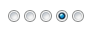

NurikabeStarRatingBundle
===================

[](https://insight.sensiolabs.com/projects/c8e7b3ff-b68c-424a-933a-2091db8cfafa)

Form type and Twig filter for FyneWorks' super fine jQuery [Star Rating Plugin](https://github.com/Fyneworks-jQuery/star-rating).

Installation
------------

### Manually add a repository for the Star Rating Plugin

This is the easiest way to ensure that you have the Star Rating Plugin installed.  Add a repository to
`composer.json`:

``` json
    "repositories": [
        {
            "type": "package",
            "package": {
                "name": "fyneworks/star-rating",
                "version": "dev-master",
                "source": {
                    "type": "git",
                    "url": "https://github.com/fyneworks/star-rating.git",
                    "reference": "master"
                }
            }
        }
    ]
```

### Add the bundle to your dependencies

``` json
    "require": {
        "nurikabe/star-rating-bundle": "2.0.0"
        ...
    }
```

### Register the bundle in your kernel

``` php
public function registerBundles()
{
    $bundles = array(
        // ...
        new Nurikabe\StarRatingBundle\NurikabeStarRatingBundle(),
        // ...
    );
```

### Update your packages

``` bash
$ php composer.phar update nurikabe/star-rating-bundle
```

If you define a repository for `fyneworks/star-rating` as per the above then installing `nurikabe/star-rating-bundle`
should also install the `fyneworks/star-rating` dependency.

Usage
-----

Load the Star Rating plugin in your layout.  For example, if you are using Assetic and you have installed Star Rating
via Composer as per above:

``` twig

    <link rel="stylesheet" href="{{ asset_url }}" />

{% javascripts '%kernel.root_dir%/../vendor/fyneworks/star-rating/jquery.rating.js' %}
    <script type="text/javascript" src="{{ asset_url }}"></script>

```

Of course, remember to dump your assets if `use_controller` is off:

``` bash
$ app/console assetic:dump
```

This bundle contains a new FormType `star_rating` field type:

``` php
$builder->add('rating', 'star_rating', array(
    'choices' => array(1 => 'ichi', 2  => 'ni', 3 => 'san', 4=> 'shi', 5 => 'go'),
    'expanded' => true,  // radio or checkbox...
    'multiple' => false  // ...but not checkbox
));
```

`star_rating` extends `choice` and will render expanded `choice` fields as a Star Rating field.

Original `choice` field:



As a `star_rating` field:


A Twig filter is also available that will render a static Star Rating widget given a numeric input:

``` twig
{{ entity.rating|star_rating }}
```

